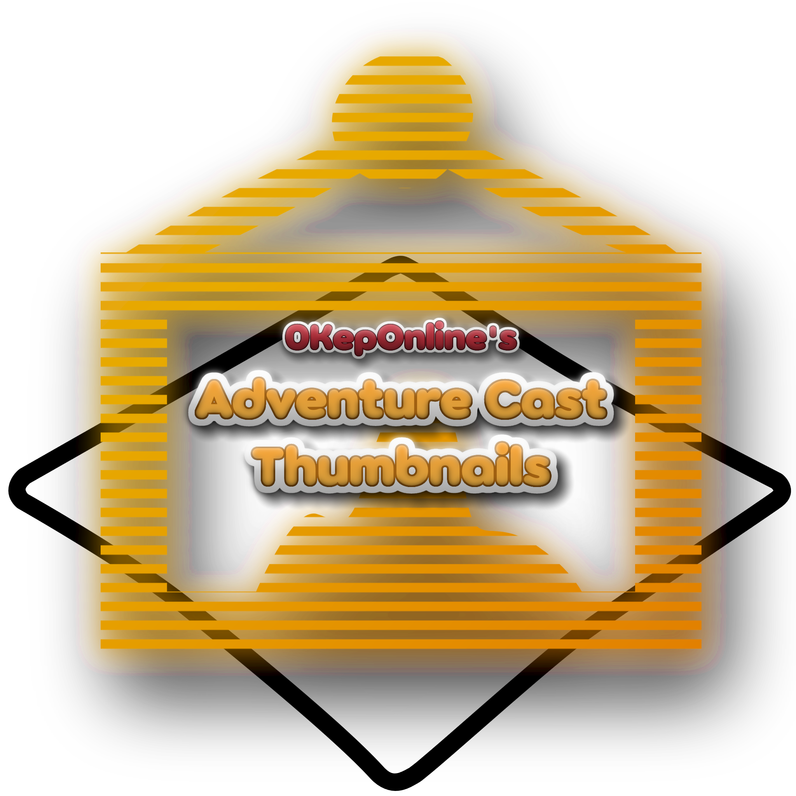

    

# 0KepOnline's Adventure Cast Thumbnails

This mod lets you customize thumbnails of your cast in the palette of the Adventure Editor. Custom thumbnails can be used to distinguish between many objects of the same kind, making it easier to build complex adventures. Keep in mind that the thumbnails you use must be published with the adventure to keep it playable, so consider clearing ones that you don’t want to publish before the adventure is released.

All the adventures made with it are share-safe.

## Credits
 * **[0KepOnline](https://github.com/0KepOnline)**	(experimenting with disguising non-gameplay objects and creating this mod)
 * **[A-xesey](https://github.com/A-xesey)**	(providing addresses of functions in the DVD version of Spore: Galactic Adventures)

 (additional translation credits can be found in `.locale` files [here](./data/0KepOnlineScenarioCastThumbnails/root~/))

 **Special thanks to:**
 * **[emd4600](https://github.com/emd4600)**	(creating [SporeModder FX](https://github.com/emd4600/SporeModder-FX) and [Spore ModAPI](https://github.com/emd4600/Spore-ModAPI))
